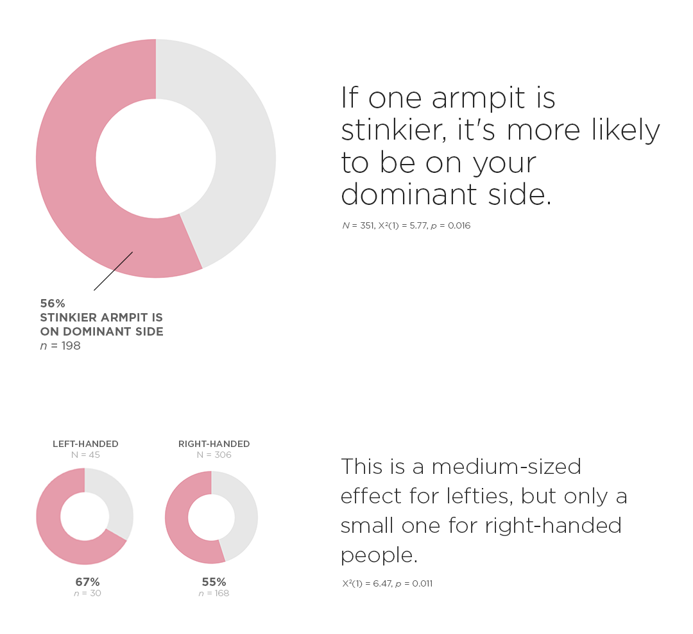
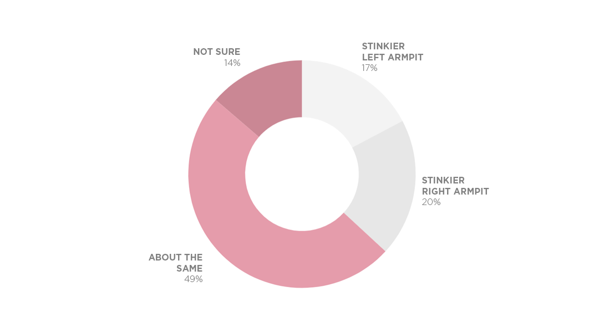

Armpit Survey Results
================
7/29/2019

I had a hunch that armpits were stinkier on the same side as the
dominant hand. This is what I found.

## Participants

The initial sample was 987 people, r/SampleSize subreddit users and my
Facebook friends. 48% identified as female, 48% identified as male, 1%
preferred not to say, and 2% self-described (with most describing
themselves as “Agender”). 86% were right-handed, 11% were left-handed,
3% were ambidextrous.

A surprising amount (63%) said both armpits smelled the same or weren’t
sure. (These weren’t included in my analysis because my hunch was about
armpit smell asymmetry.)

## Other Notes

  - Handedness did not change the proportion of people who armpits
    “smelled about the same” or were “not sure”. The proportion also
    held for ambidextrous people, though interestingly, they had
    smellier *right* armpits at about a 9:1 ratio.
  - Gender did not change the proportion of stinky armpits on dominant
    vs non-dominant side.
  - 11% of the sample were lefties, which roughly matches the 10% found
    in the population.
  - Only 15 respondents were ambidextrous, 3% of the initial sample.

## Limitations

  - I should have asked which armpit is smellier **without deodorant**.
    I wonder how much of “about the same” responses were due to the
    masking effect of deodorant.
  - There should have been a response option for “No smell”, which
    apparently 2% of the population has
    (<https://www.smithsonianmag.com/science-nature/a-lucky-two-percent-of-people-have-a-gene-for-stink-free-armpits-2508106>).
    If that rate holds for the sample, that would have been about 20
    respondents. Practically though, this issue does not affect the
    primary analysis, which only examined armpit stinkiness asymmetry.

<!-- end list -->

    {r css, echo=FALSE}
    
    st_css()                              # This is a must; without it, expect odd layout,
                                          # especially with dfSummary()

## Table of the Full Sample

    ## Cross-Tabulation, Column Proportions  
    ## Armpit * Hand  
    ## Data Frame: df  
    ## 
    ## ---------------- ------ -------------- -------------- -------------- --------------
    ##                    Hand   Ambidextrous      Left hand     Right hand          Total
    ##           Armpit                                                                   
    ##   About the same           15 ( 55.6%)    45 ( 41.7%)   426 ( 50.1%)   486 ( 49.3%)
    ##             Left            1 (  3.7%)    30 ( 27.8%)   139 ( 16.3%)   170 ( 17.2%)
    ##         Not sure            2 (  7.4%)    18 ( 16.7%)   117 ( 13.7%)   137 ( 13.9%)
    ##            Right            9 ( 33.3%)    15 ( 13.9%)   169 ( 19.9%)   193 ( 19.6%)
    ##            Total           27 (100.0%)   108 (100.0%)   851 (100.0%)   986 (100.0%)
    ## ---------------- ------ -------------- -------------- -------------- --------------

## Open-ended Feedback

I asked, “Do you have any feedback about the survey?” Here are some
notable responses and my reply, if any.

<table>

<thead>

<tr>

<th style="text-align:left;">

Feedback

</th>

<th style="text-align:left;">

Reply from Fred

</th>

</tr>

</thead>

<tbody>

<tr>

<td style="text-align:left;">

Wtf

</td>

<td style="text-align:left;">

</td>

</tr>

<tr>

<td style="text-align:left;">

This is weird. Go Fred\!

</td>

<td style="text-align:left;">

</td>

</tr>

<tr>

<td style="text-align:left;">

The armpit question is creepy

</td>

<td style="text-align:left;">

</td>

</tr>

<tr>

<td style="text-align:left;">

I can only use the white deodorant, the colored gel ones irritate my
armpits.

</td>

<td style="text-align:left;">

</td>

</tr>

<tr>

<td style="text-align:left;">

Just spent two minutes smelling my armpits for this so I hope you get
results lol

</td>

<td style="text-align:left;">

</td>

</tr>

<tr>

<td style="text-align:left;">

My armpits smell like grapefruit

</td>

<td style="text-align:left;">

</td>

</tr>

<tr>

<td style="text-align:left;">

It was great, thoughtful and provocative. Your doctoral studies cut to
the core of the human condition.

</td>

<td style="text-align:left;">

beautiful comment

</td>

</tr>

<tr>

<td style="text-align:left;">

As someone who works outdoors a lot through the summer, my pits smell
the same. When I sweat, it’s all over, not one out vs the other. I think
you should ask paraplegics who only have 1 arm this question.

</td>

<td style="text-align:left;">

</td>

</tr>

<tr>

<td style="text-align:left;">

no, i just wanted to say that you are an amazing person

</td>

<td style="text-align:left;">

thank you

</td>

</tr>

<tr>

<td style="text-align:left;">

there are more than 2 questions\!

</td>

<td style="text-align:left;">

I said two *required* questions\!

</td>

</tr>

<tr>

<td style="text-align:left;">

Neither of my armpits smell

</td>

<td style="text-align:left;">

</td>

</tr>

<tr>

<td style="text-align:left;">

I doubt most people know which armpit smells more

</td>

<td style="text-align:left;">

</td>

</tr>

<tr>

<td style="text-align:left;">

do you guys really have one smellier armpit???

</td>

<td style="text-align:left;">

yes

</td>

</tr>

<tr>

<td style="text-align:left;">

I have always wondered about this, THANK YOU

</td>

<td style="text-align:left;">

brilliant minds

</td>

</tr>

<tr>

<td style="text-align:left;">

Hey, I’m not shaming your kink.

</td>

<td style="text-align:left;">

</td>

</tr>

<tr>

<td style="text-align:left;">

You just want to make people smell their armpits don’t you?

</td>

<td style="text-align:left;">

</td>

</tr>

<tr>

<td style="text-align:left;">

I think I see where you’re going with this, the armpit of the dominant
hand will be stinkier. However, I have noticed that on the very rare
occasion my pits stink ;) they both smell equally bad.

</td>

<td style="text-align:left;">

</td>

</tr>

<tr>

<td style="text-align:left;">

genius

</td>

<td style="text-align:left;">

</td>

</tr>

<tr>

<td style="text-align:left;">

I thought you would ask the aroma

</td>

<td style="text-align:left;">

weird

</td>

</tr>

<tr>

<td style="text-align:left;">

I had to sneak a wiff of both my armpits in the middle of work; got some
weird looks.

</td>

<td style="text-align:left;">

</td>

</tr>

<tr>

<td style="text-align:left;">

I hope you’re not a creep

</td>

<td style="text-align:left;">

I hope not either

</td>

</tr>

<tr>

<td style="text-align:left;">

You said two questions and there were three. \>:(

</td>

<td style="text-align:left;">

there were actually 5, but only 2 were required\!

</td>

</tr>

<tr>

<td style="text-align:left;">

I put on deodorant recently so I used which armpit smelled more earlier
today that prompted me to add more deodorant

</td>

<td style="text-align:left;">

</td>

</tr>

<tr>

<td style="text-align:left;">

Ask them what nostril they use more (and footedness). Good luck.

</td>

<td style="text-align:left;">

wat

</td>

</tr>

<tr>

<td style="text-align:left;">

wtf

</td>

<td style="text-align:left;">

</td>

</tr>

<tr>

<td style="text-align:left;">

what

</td>

<td style="text-align:left;">

</td>

</tr>

<tr>

<td style="text-align:left;">

Strange

</td>

<td style="text-align:left;">

</td>

</tr>

<tr>

<td style="text-align:left;">

yeah, what the fuck?

</td>

<td style="text-align:left;">

</td>

</tr>

<tr>

<td style="text-align:left;">

I answered according to how my armpits smell right now, i have no clue
how they usually smell

</td>

<td style="text-align:left;">

</td>

</tr>

<tr>

<td style="text-align:left;">

Male/Female is sex, Man/Woman is gender.

</td>

<td style="text-align:left;">

</td>

</tr>

<tr>

<td style="text-align:left;">

why are you asking this of me

</td>

<td style="text-align:left;">

</td>

</tr>

<tr>

<td style="text-align:left;">

But why…

</td>

<td style="text-align:left;">

</td>

</tr>

<tr>

<td style="text-align:left;">

I always smell check my left armpit.

</td>

<td style="text-align:left;">

</td>

</tr>

<tr>

<td style="text-align:left;">

I never noticed either armpit smelling worse than the other, but I did
notice that my BO changed *massively* after having a baby, and not for
the better\! I had a boy, and now I smell more masculine too, plus SNRIs
make me sweat like a pig.

</td>

<td style="text-align:left;">

</td>

</tr>

<tr>

<td style="text-align:left;">

I don’t really know if I should be considered ambidextrous since i’m a
natural lefty but was forced into writing and using my right

</td>

<td style="text-align:left;">

</td>

</tr>

<tr>

<td style="text-align:left;">

Going into this i had no idea what your hunch was and then when I read
the second question my mind was BLOWN

</td>

<td style="text-align:left;">

</td>

</tr>

<tr>

<td style="text-align:left;">

It might be relevant to ask about when people last put on deodorant.
Small differences not long after applying deodorant may make people
think the smell is equal.

</td>

<td style="text-align:left;">

good point

</td>

</tr>

<tr>

<td style="text-align:left;">

very interesting and slightly strange haha. interested in seeing what
happens. I was just at the gym doing boxing and I tend to punch more
with my left arm than my right so that might have thrown things off?

</td>

<td style="text-align:left;">

</td>

</tr>

<tr>

<td style="text-align:left;">

I can’t believe u got me to Fuckin sniff my armpits lmao

</td>

<td style="text-align:left;">

</td>

</tr>

<tr>

<td style="text-align:left;">

self reports are not science

</td>

<td style="text-align:left;">

this person needs to run for president

</td>

</tr>

<tr>

<td style="text-align:left;">

Armpit smell for me depends on my sitting position. If one armpit gets
more ventilation than the other, the ventilated one smells less

</td>

<td style="text-align:left;">

</td>

</tr>

<tr>

<td style="text-align:left;">

Why

</td>

<td style="text-align:left;">

</td>

</tr>

<tr>

<td style="text-align:left;">

Marry me

</td>

<td style="text-align:left;">

I’m taken. but I can ask my partner about polyamory.

</td>

</tr>

</tbody>

</table>

## Tools

I used R for analyses and Google Sheets and Photoshop for data
visualization.
