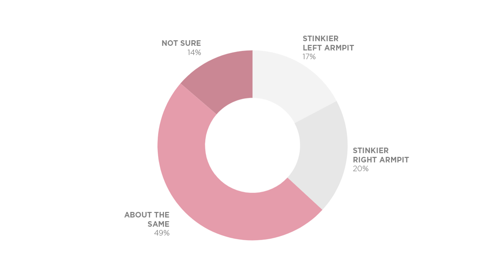

I had a hunch that armpits were stinkier on the same side as the dominant hand. This is what I found. 


## Participants

The initial sample was 987 people, r/SampleSize subreddit users and my Facebook friends. 48% identified as female, 48% identified as male, 1% preferred not to say, and 2% self-described (with most describing themselves as "Agender"). 86% were right-handed, 11% were left-handed, 3% were ambidextrous.

A surprising amount (63%) said both armpits smelled the same or weren't sure. (These weren't included in my analysis because my hunch was about armpit smell asymmetry.)



## Other Notes

* Handedness did not change the proportion of people who armpits "smelled about the same" or were "not sure". The proportion also held for ambidextrous people, though interestingly, they had smellier *right* armpits at about a 9:1 ratio.
* Gender did not change the proportion of stinky armpits on dominant vs non-dominant side.
* 11% of the sample were lefties, which roughly matches the 10% found in the population.
* Only 15 respondents were ambidextrous, 3% of the initial sample. 

## Limitations

* I should have asked which armpit is smellier **without deodorant**. I wonder how much of "about the same" responses were due to the masking effect of deodorant.
* There should have been a response option for "No smell", which apparently 2% of the population has (https://www.smithsonianmag.com/science-nature/a-lucky-two-percent-of-people-have-a-gene-for-stink-free-armpits-2508106). If that rate holds for the sample, that would have been  about 20 respondents. Practically though, this issue does not affect the primary analysis, which only examined armpit stinkiness asymmetry.

```{r setup, include=FALSE}
library(tidyverse)
library(summarytools)
library(kableExtra)
```


```{r read in, include=F}
df<-read_csv("armpit.csv")

opts_chunk$set(results = 'asis',      # This is essential (can also be set at the chunk-level)
               comment = NA,
               prompt = FALSE,
               cache = FALSE)

st_options(plain.ascii = FALSE,       # This is very handy in all Rmd documents
           style = "rmarkdown",        # This too
           footnote = NA,             # Avoids footnotes which would clutter the results
           subtitle.emphasis = FALSE  # This is a setting to experiment with - according to
)                                     # the theme used, it might improve the headings'
                                      # layout

```

```
{r css, echo=FALSE}
st_css()                              # This is a must; without it, expect odd layout,
```                                   # especially with dfSummary()

## Table of the Full Sample

```{r full sample table, echo=F}
# full sample table
with(df, ctable(Armpit, Hand, prop = "c")) %>%
  print(method = "render")

```


```{r filter and code, include=F}
df <- df[,18:length(df)]
df=df %>%
  filter(is.na(filter))

df$Same <- NA
df$Same[df$Hand=="Left hand"  & df$Armpit=="Left"]  <- "same"
df$Same[df$Hand=="Right hand" & df$Armpit=="Right"] <- "same"
df$Same[df$Hand=="Right hand" & df$Armpit=="Left"]  <- "different"
df$Same[df$Hand=="Left hand"  & df$Armpit=="Right"] <- "different"
  
```


```{r crosstabs, include = F}
# final sample table
with(df, ctable(Armpit, Hand))

df.simple=df %>%
  filter(Armpit != "About the same", 
         Armpit != "Not sure",
         Hand != "Ambidextrous") 

df.simple %>%
  with(ctable(Hand, Armpit))

df.simple %>%
  with(table(Hand, Armpit))  %>%
  chisq.test()

# pwr.chisq.test(w =, N = , df = , sig.level =, power = )
```

```{r chi sqs, include = F}
df %>%
  filter(!is.na(Same)) %>%
  with(table(Same))

df %>%
  filter(!is.na(Same)) %>%
  with(table(Same)) %>%
  chisq.test

#left hand - chi sq for left vs right smelly armpit
df %>%
  filter(!is.na(Same)) %>%
  filter(Hand == "Left hand") %>%
  with(table(Armpit)) %>%
  chisq.test

#right hand - chi sq for left vs right smelly armpit
df %>%
  filter(!is.na(Same)) %>%
  filter(Hand == "Right hand") %>%
  with(table(Armpit)) %>%
  chisq.test
```

```{r ctab gender, include = F}
df%>%
  filter(gender=="Male") %>%
  with(ctable(Hand,Armpit))
```


## Open-ended Feedback

I asked, "Do you have any feedback about the survey?" Here are some notable responses and my reply, if any.

```{r show feedback, echo=F}
options(knitr.kable.NA = '')
df %>%
  filter(feedback_show==1) %>%
  select(c(feedback, feedback_fred)) %>%
  rename(Feedback=feedback,
         `Reply from Fred`=feedback_fred) %>%
  kable(format="html") 
```


## Tools
I used R for analyses and Google Sheets and Photoshop for data visualization. 


